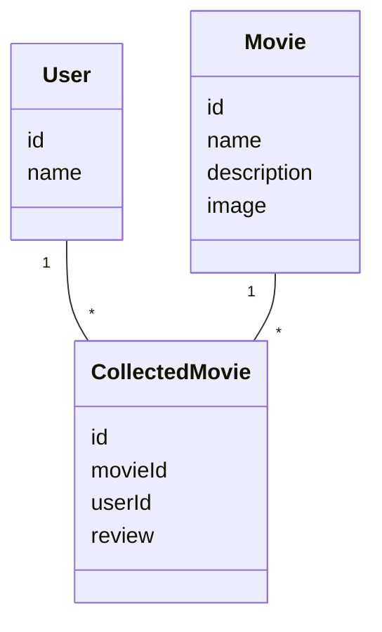
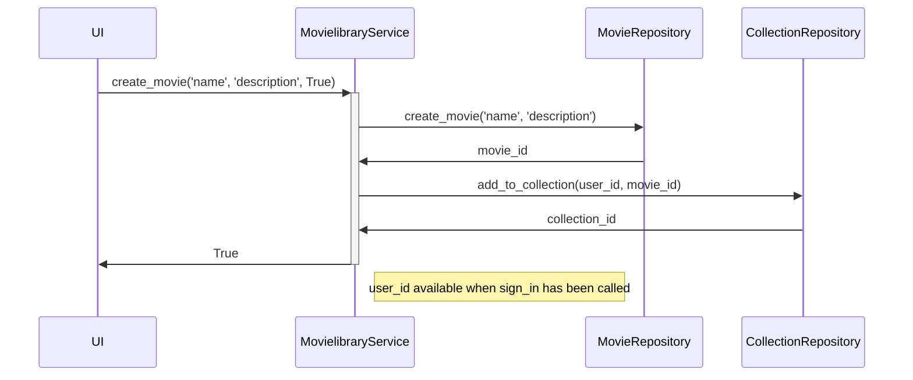

Alustava luokkakaavio. Tarkentuu sovelluksen kehittyessä.

```mermaid
  classDiagram
    User "1" -- "*" CollectedMovie
    Movie "1" -- "*" CollectedMovie

  class User {
    id
    name
  }

  class Movie {
    id
    name
    description
    image
  }

  class CollectedMovie {
    id
    movieId
    userId
    review
  }
```

Tässä sekvenssikaavio, joka kuvaa elokuvan luonti- ja kokoelman lisäämisprosessia.

```mermaid
  sequenceDiagram
    %% UI ->> MovielibraryService : movie_library
    %% MovielibraryService ->> MovieRepository : MovieRepository()
    %% MovielibraryService ->> CollectionRepository : CollectionRepository()

    UI ->>+ MovielibraryService : create_movie('name', 'description', True)
    MovielibraryService ->> MovieRepository : create_movie('name', 'description')
    MovieRepository ->> MovielibraryService : movie_id
    MovielibraryService ->> CollectionRepository : add_to_collection(user_id, movie_id)
    CollectionRepository ->> MovielibraryService : collection_id
    MovielibraryService ->>- UI : True

    note right of MovielibraryService: user_id available when sign_in has been called
```
