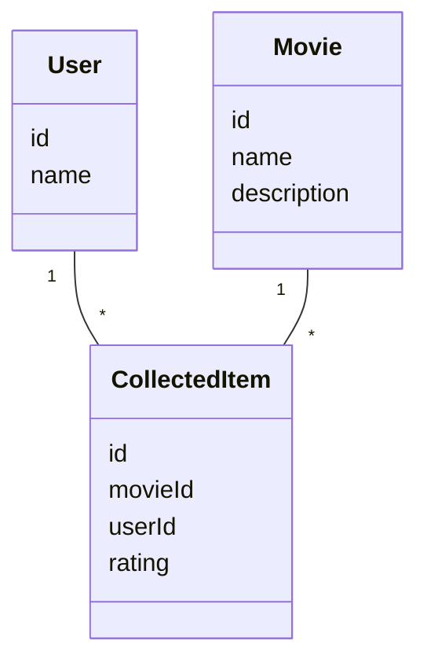
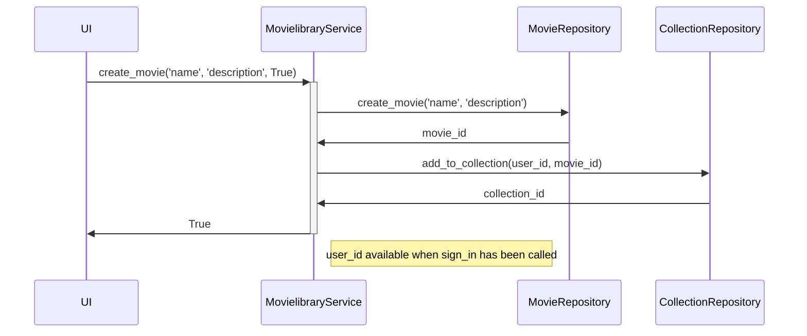

# sovelluksen arkkitehtuurikuvaus

Sovellus on toteutettu kutakuinkin kurssilla esitetyn mallin mukaisesti; eriytettynä ui, service ja repo -jaon mukaisesti. Ui hoitaa vain käyttöliittymään liittyvät asiat, ja kommunikoi repojen kanssa keskitetyn servicen (`MovielibraryService`) kautta. Repoja on tietokantataulujen mukaisesti (`UserRepository`, `MovieRepository` ja `CollectionRepository`).

Alla oleva luokkakaavio kuvaa suurin piirtein sovelluksen tietorakennetta.

Järjestelmässä on siis käyttäjiä ja ns. globaali elokuvalista. Käyttäjät voivat lisätä järjestelmässä olevia elokuvia omaan kokoelmaansa. Yksi elokuva voi olla useamman käyttäjän kokoelmassa, mutta sama elokuva voi olla vain kerran saman käyttäjän kokoelmassa.

Repon juuressa oleva `schema.sql` kuvaa tarkemmin sovelluksen tietotyyppejä ja niiden suhteita.

Käyttöliittymä sisältää tarvittavat näkymät, joilla voi hyödyntää yllä mainittuja tietoja.

Seuraavaksi esitellään sekvenssikaavio, joka kuvaa elokuvan luonti- ja kokoelman lisäämisprosessia.

Tässä nähdään juurikin, miten kurssilla esitetty malli (`ui <-> service <-> repo`) toteutuu sovelluksessa.

Tarkemmin tähän voi tutustua katsomalla koodia, jossa on jopa docstring-kommentit.

## konfiguraatio ja tietojen tallennus

Taustalla sovellus käyttää sqlitea. Sovellus luo erillisellä komennolla juurihakemistoonsa tietokannan (testiympäristöllä on oma kantansa).

Suurin osa konfiguraatiosta on ns. kovakoodattuna, mutta ympäristömuuttujalla `TMDB_KEY` voidaan aktivoida elokuvien hakutoiminto tmdb:ta käyttäen. Muuttujan arvo on oltava toimiva tmdb:n api-avain.

## heikkoudet

* jos haluaa lisätä elokuvista tallennettavia tietoja, voi tämä vaatia jonkin verran refaktorointia
* sqliten käyttö saattaa hankaloittaa sovelluksen ns. portabiliteettia
