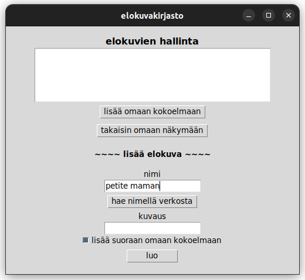

# käyttöohje

## aloitustoimenpiteet

Seuraa readmen ohjeita asentaaksesi ohjelman.

Kun käynnistät ohjelman `TMDB_KEY`-ympäristömuuttujalla, on [tmdb](https://developer.themoviedb.org/docs/getting-started)-hakutoiminto myös käytettävissäsi:

```sh
TMDB_KEY=tmdb-avain poetry run invoke start
```

## toiminnallisuus

### kirjautuminen

Ohjelman käynnistyessä näet kirjautumisruudun. Valitse käyttäjä listalta ja kirjaudu tai luo uusi käyttäjä:


### oma kokoelma

Kun olet kirjautunut, näet oman kokoelmasi ja pääset myös muokkaamaan ohjelmiston kaikkien käyttäjien yhteistä elokuvalistaa:


### elokuvan lisääminen tmdb:n avulla

Syötä hakusana elokuvanäkymässä ja paina "hae nimellä verkosta":



Esille tulee lista, jolta voit valita oikean elokuvan:


Valittu elokuva lisätään elokuvien joukkoon, sekä omaan kokoelmaasi, jos olet näin valinnut.

### elokuvan lisääminen täysin käsin

Syötä elokuvanäkymässä kaikki vaaditut tiedot:


Luotu elokuva näkyy listalla:


Järjestelmän uusimmassa versiossa (11.5.2025) pääset myös tämän listan kautta tarkastelemaan elokuvan tarkempia tietoja ja voit myös antaa oman numeerisen arviosi elokuvasta.

### järjestelmästä poistuminen

Voit omasta kokoelmanäkymästäsi kirjautua ulos (huomaa! nyt näet aiemmin kokoelmaasi lisätyn elokuvan):


Palaat kirjautumisnäkymään:


## kysymyksiä ja vastauksia

* **mitä listoissa hakasulkeiden välissä olevat numerot tarkoittavat:** numero on uniikki, pysyvä tunniste kyseiselle valinnalle
* **voinko suojata tilini salasanalla:** et
