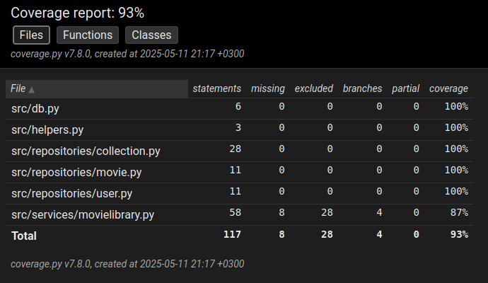

# sovelluksen testaus

Sovellusta testataan automaattisin ja käsin tehtävin menetelmin.

## automaattiset yksikkö- ja integraatiotestit

Nämä pyörii pytestin avulla. Automaattisesti testataan sekä `MovielibraryService`a sekä repositoryja. Osa servicen ja repositoryjen testeistä ovat päällekkäisiä.

Testeissä käytetään omaa tietokantaa `elokuvat_test.db`.

### kattavuus

Kattavuus on 93 %. Testaamatta jää tällä hetkellä sqliten `IntegrityError`it. Tällä hetkellä koodi on toteutettu niin, että näiden virheiden testaaminen rikkoo koko testauksen. Ajanpuutteen vuoksi tätä ei ole ehditty korjata. Itse sovellusta normaalisti käyttäessä ongelmia ei esiinny.

Testit ohittaa `tmdb`-integraatioon liittyvät hommat, sekä UI:n ja muita osia, joita ei ole ihanteellista testata tällä menetelmällä...

## järjestelmätestaus

Järjestelmää on testattu myös käsin käymällä läpi vaatimusmäärittelyn mukaiset toteutetut toiminnallisuudet. On myös testattu, että ei-toivotut syötteet eivät aiheuta kaatumisia yms. epätoivottavia ongelmia.

Testit on suoritettu Linuxilla ja olettaen, että käyttäjä on seurannut annettuja ohjeita (asennus, käyttö). Ohjelman toimivuutta ei voi taata, mikäli ohjeita ei seurata. Ohjelmaan ei ole myöskään toteutettu "turvaverkkoa" tällaisten käyttäjien varalle. Ohjelmiston toimivuutta ei voida myöskään taata epämääräisissä toimintaympäristöissä.
